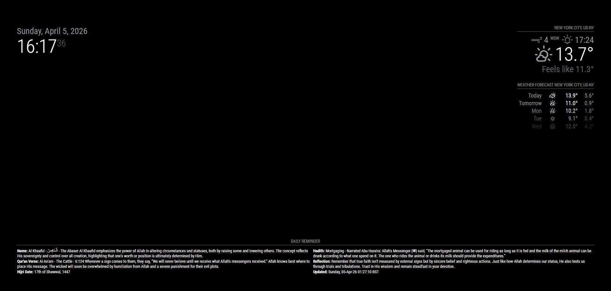

# MMM-ILM-DailyReminder

A lightweight [MagicMirror²](https://magicmirror.builders/) module that shows a daily reminder from **https://reminder.dev/api**. Includes Hadith, Quran Verse, Name and Reflection.

Position: bottom_bar


Position: bottom_left

## Requirements
- MagicMirror²
- **Node.js v18 or newer** on the host (check with `node -v`)
- The api is hosted on https://reminder.dev. A key is not required to make a request.

## Dependencies

This module has no mandatory external dependencies. It fetches data from an API, and as a safety measure, it supports HTML sanitization using DOMPurify (https://github.com/cure53/dompurify). DOMPurify is included automatically when you run npm install, but it is optional — the module will function correctly even if DOMPurify is not installed.

## Installation

To install the module, clone the repository into the `~/MagicMirror/modules/` directory and install the dependencies:

```sh
cd ~/MagicMirror/modules/
git clone https://github.com/mdbkabirbd/MMM-ILM-DailyReminder
cd MMM-ILM-DailyReminder
npm install
```

### Configuration

Add the module to the modules array in the `config/config.js` file:

```javascript
  {
    module: "MMM-ILM-DailyReminder",
    position: "bottom_bar",
    header: "Daily Reminder",
    config: {
      apiUrl: "https://reminder.dev/api/daily",
      updateInterval: 60 * 60 * 1000,
      animationSpeed: 2 * 1000,
      fontSize: "14px",
      maxWidth: "100%",
      emptyText: "Loading...",
   }
  },
```
   
Notes: 
To ensure the special ligature such as (ﷺ) displays correctly—especially on devices like the Raspberry Pi, where default fonts may not support it—it’s recommended to install an additional font set such as Google Noto. The Noto family is designed to cover the full range of Unicode characters, providing reliable rendering for special script and ligatures.

```sh
sudo apt install fonts-noto-ui-core
sudo apt install fonts-noto-extra
fc-cache -f -v
```
## Update

To update the module, go to the module directory, pull the latest changes, and install any new dependencies:

```sh
cd ~/MagicMirror/modules/MMM-ILM-DailyReminder
git pull
npm install
```

## Configuration Options

The following properties can be configured:

<table width="100%">
	<thead>
		<tr>
			<th>Option</th>
			<th width="100%">Description</th>
		</tr>
	<thead>
	<tbody>	
		<tr>
			<td><code>apiUrl</code></td>
			<td>
				URL endpoint hosted on <code>https://reminder.dev</code>.<br><br>
				<b>Default:</b> <code>https://reminder.dev/api/daily</code><br>
				The daily reminder is updated once per day.<br><br>
				<b>Alternative:</b> <code>https://reminder.dev/api/latest</code><br>
				This endpoint updates hourly. When using it, it is recommended to set a shorter <code>updateInterval</code> (e.g., 10 minutes).<br><br>
				This value is <b>OPTIONAL</b>.
			</td>
		</tr>		
		<tr>
			<td><code>animationSpeed</code></td>
			<td>
				Integer value representing the duration of the reminder’s display animation, in milliseconds.<br><br>
				<b>Example:</b> <code>5000</code><br>
				<b>Default:</b> <code>2 * 1000</code><br>
				This value is <b>OPTIONAL</b>.
			</td>
		</tr>
		<tr>
			<td><code>initialLoadDelay</code></td>
			<td>
				Integer value specifying a delay before the first API fetch is displayed, in milliseconds.<br><br>
				<b>Example:</b> <code>2000</code><br>
				<b>Default:</b> <code>1000</code><br>
				This value is <b>OPTIONAL</b>.
			</td>
		</tr>		
		<tr>
			<td><code>maxWidth</code></td>
			<td>
				Specifies the module width in px or %. Because the fetched text varies in length, this module displays best in the top or bottom bar. It can also be placed on the left or right with appropriate <code>maxWidth</code> and <code>fontSize</code> adjustments.<br><br>
				<b>Example:</b> <code>100% (top/bottom)</code>, <code>400px (left/right)</code><br>
				<b>Default:</b> <code>100%</code><br>
				This value is <b>OPTIONAL</b>.
			</td>
		</tr>
		<tr>
			<td><code>headerText</code></td>
			<td>
				Custom header text.<br><br>
				<b>Example:</b> <code>Daily Reminder</code><br>
				<b>Default:</b> <code>"Daily Reminder"</code><br>
				This value is <b>OPTIONAL</b>.
			</td>
		</tr>        
		<tr>
			<td><code>showHeader</code></td>
			<td>
				Determines whether the custom header is displayed.<br><br>
				<b>Example:</b> <code>false</code><br>
				<b>Default:</b> <code>false</code><br>
				This value is <b>OPTIONAL</b>.
			</td>
		</tr>   
        <tr>
			<td><code>fontSize</code></td>
			<td>
				Specifies the font size in pixels.<br><br>
				<b>Example:</b> <code>14px</code><br>
				<b>Default:</b> <code>14px</code><br>
				This value is <b>OPTIONAL</b>.
			</td>
		</tr>
        <tr>
			<td><code>emptyText</code></td>
			<td>
				Text displayed while waiting for the API response.<br><br>
				<b>Example:</b> <code>Waiting for reminder...</code><br>
				<b>Default:</b> <code>Waiting for reminder...</code><br>
				This value is <b>OPTIONAL</b>.
			</td>
		</tr> 
        <tr>
			<td><code>errorText</code></td>
			<td>
				Text displayed if the API request fails.<br><br>
				<b>Example:</b> <code>Unable to load reminder.</code><br>
				<b>Default:</b> <code>Unable to load reminder.</code><br>
				This value is <b>OPTIONAL</b>.
			</td>
		</tr>         
    </tbody>
</table>
